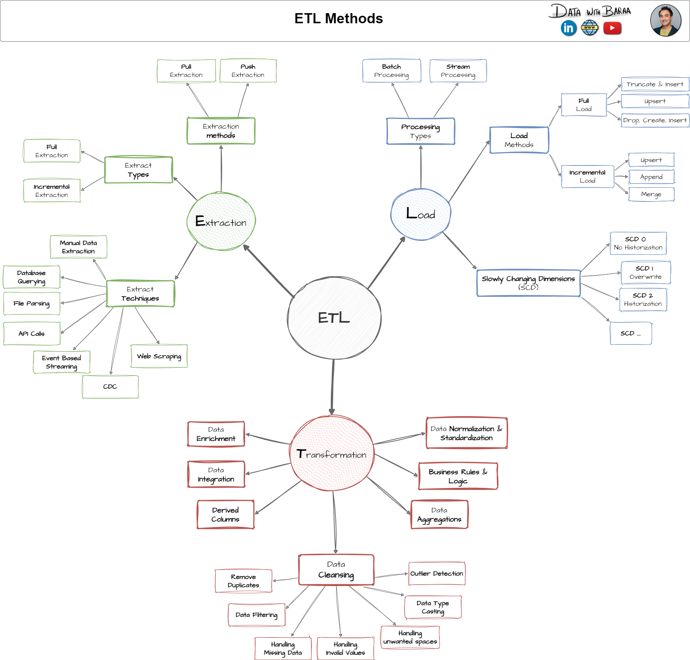
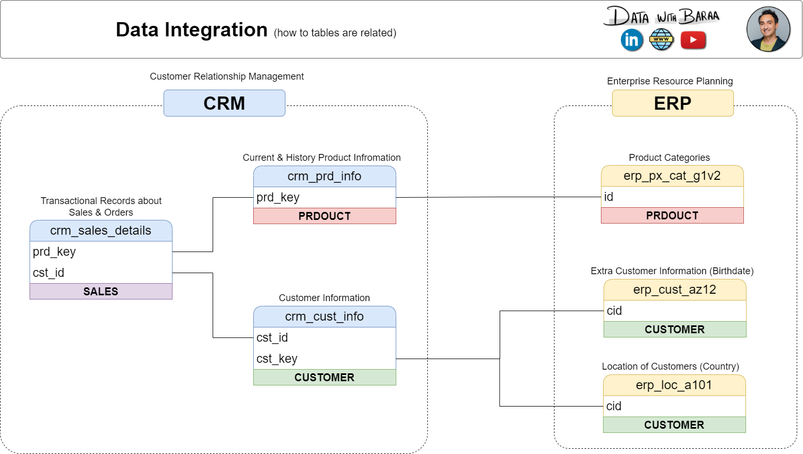
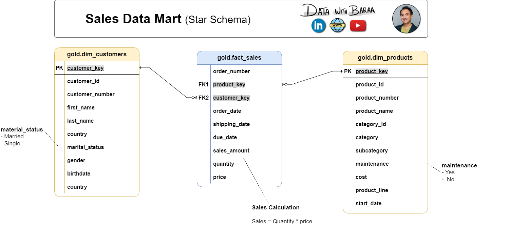

<div align="center">

# 🏭 Enterprise Sales Data Warehouse
### A Modern ETL & Data Warehousing Project with SQL Server

*Building a scalable, layered data warehouse from raw CRM & ERP files to business‑ready analytics — using the Medallion Architecture (Bronze → Silver → Gold).*


</div>

---

## 📖 About This Project

This repository implements a **complete data warehouse solution** — from raw source ingestion to a business‑ready star schema — built entirely in **T‑SQL on SQL Server**. It follows the industry‑standard **Medallion (Bronze / Silver / Gold) Architecture**, taking data from two source systems (**CRM** and **ERP**) and transforming it into a clean, analytics‑ready **Sales Data Mart**.

It's designed as a hands‑on demonstration of core data engineering skills:

- 🗂️ **Data Architecture** — designing layered storage for raw, cleaned, and curated data
- 🔄 **ETL Pipelines** — extracting, transforming, and loading data with stored procedures
- 🧹 **Data Cleansing** — handling nulls, duplicates, inconsistent formats, and invalid values
- 🌟 **Dimensional Modeling** — building fact and dimension tables in a star schema
- ✅ **Data Quality Checks** — automated validation scripts for the Silver layer
- 📊 **Analytics‑Ready Views** — Gold layer views ready for BI tools, ad‑hoc SQL, or ML

---

## 🏗️ Data Architecture

The warehouse follows the **Medallion Architecture**, with each layer adding structure and business value to the data as it flows through the pipeline.


| Layer | Purpose | Object Type | Transformations |
|-------|---------|-------------|------------------|
| 🥉 **Bronze** | Raw data, loaded as-is from source CSV files | Tables | None — full load / truncate & insert |
| 🥈 **Silver** | Cleaned, standardized, and enriched data | Tables | Cleansing, standardization, normalization, derived columns |
| 🥇 **Gold** | Business-ready, curated data | Views | Data integration, aggregation, business logic |

**Sources → Warehouse → Consumption**

- **Sources:** CRM & ERP systems, delivered as flat CSV files
- **Warehouse:** SQL Server, structured into Bronze → Silver → Gold
- **Consume:** BI & Reporting dashboards, ad‑hoc SQL analysis, and Machine Learning

---

## 🔄 ETL Approach

Data moves through the pipeline using a **batch processing, full-load (truncate & insert)** pattern, orchestrated with T‑SQL stored procedures at each layer.



## 🔀 Data Flow & Lineage

The diagram below traces every source file through the Bronze and Silver layers into its final destination in the Gold layer.


## 🔗 Data Integration

CRM and ERP entities are mapped and joined together across systems to form a unified customer and product view.



## 🌟 Data Model — Star Schema

The Gold layer exposes a clean **Star Schema** — one fact table surrounded by descriptive dimensions — optimized for fast, intuitive analytical queries.



| Table | Type | Description |
|-------|------|-------------|
| `gold.dim_customers` | Dimension | Customer demographic & geographic attributes |
| `gold.dim_products` | Dimension | Product, category, and pricing attributes |
| `gold.fact_sales` | Fact | Sales transactions linking customers & products (`sales = quantity × price`) |

📄 Full column-level definitions live in [`docs/data_catalog.md`](docs/data_catalog.md).

---

## 📂 Repository Structure

```text
sql_data_warehouse_project/
│
├── datasets/                       # Raw source data (CSV)
│   ├── source_crm/                 # cust_info, prd_info, sales_details
│   └── source_erp/                 # CUST_AZ12, LOC_A101, PX_CAT_G1V2
│
├── docs/                           # Diagrams & documentation
│   ├── data_architecture.png       # High-level architecture
│   ├── data_flow.png               # Data lineage
│   ├── data_integration.png        # Source-to-warehouse mapping
│   ├── data_model.png              # Star schema
│   ├── ETL.png                     # ETL techniques
│   ├── data_catalog.md             # Gold layer data dictionary
│   ├── naming_conventions.md       # Naming standards
│   └── Project_Notes_Sketches.pdf  # Design notes
│
├── Sql_Scripts/
│   ├── init_database.sql           # Database & schema setup
│   ├── Bronze/
│   │   ├── ddl_bronze.sql          # Bronze table definitions
│   │   └── Proc_load_bronze.sql    # Bronze load procedure
│   ├── Silver/
│   │   ├── ddl_silver.sql          # Silver table definitions
│   │   └── proc_load_silver.sql    # Silver transformation & load procedure
│   ├── Gold/
│   │   └── ddl_gold.sql            # Gold layer views (star schema)
│   └── QUERY.sql                   # Ad-hoc analytical queries
│
├── tests/
│   └── quality_checks_silver.sql   # Data quality validation checks
│
└── README.md
```

---

## 🚀 Getting Started

### Prerequisites
- Microsoft **SQL Server** (2019+) or SQL Server Express
- **SQL Server Management Studio (SSMS)** or Azure Data Studio
- This repository, cloned locally

### Setup

```bash
git clone https://github.com/Mdkamrulislam54/sql_data_warehouse_project.git
cd sql_data_warehouse_project
```

Then run the scripts in order:

1. **Initialize the database** → `Sql_Scripts/init_database.sql`
2. **Build & load the Bronze layer** → `Sql_Scripts/Bronze/ddl_bronze.sql` then `Proc_load_bronze.sql`
3. **Build & load the Silver layer** → `Sql_Scripts/Silver/ddl_silver.sql` then `proc_load_silver.sql`
4. **Run data quality checks** → `tests/quality_checks_silver.sql`
5. **Create the Gold layer views** → `Sql_Scripts/Gold/ddl_gold.sql`
6. **Explore the data** → `Sql_Scripts/QUERY.sql`

---

## ✅ Data Quality

The Silver layer includes a dedicated validation suite (`tests/quality_checks_silver.sql`) that checks for:

- Duplicate or missing primary keys
- Unwanted whitespace in text fields
- Invalid date ranges and chronology (e.g., order date after shipping date)
- Data consistency between related fields (e.g., sales = quantity × price)
- Standardized values for categorical fields (e.g., gender, marital status)

---

## 🗺️ Naming Conventions

Consistent `snake_case` naming is enforced across all layers — see [`docs/naming_conventions.md`](docs/naming_conventions.md) for the full standard, including:

- `bronze`/`silver`: `<sourcesystem>_<entity>` (e.g. `crm_cust_info`)
- `gold`: `<category>_<entity>` (e.g. `dim_customers`, `fact_sales`)
- Surrogate keys suffixed with `_key`

---

## 🛠️ Tech Stack

| Tool | Purpose |
|------|---------|
| **SQL Server** | Data warehouse engine |
| **T-SQL** | ETL logic, transformations, views |
| **SSMS** | Database development & administration |
| **Draw.io / diagrams** | Architecture & data modeling visuals |

---

## 👤 Author

**Md Kamrul Islam**
📦 [github.com/Mdkamrulislam54](https://github.com/Mdkamrulislam54)

If you found this project useful, consider giving it a ⭐ — it helps a lot!

---

<div align="center">

📜 *Licensed under the MIT License — free to use, modify, and share with attribution.*

</div>
